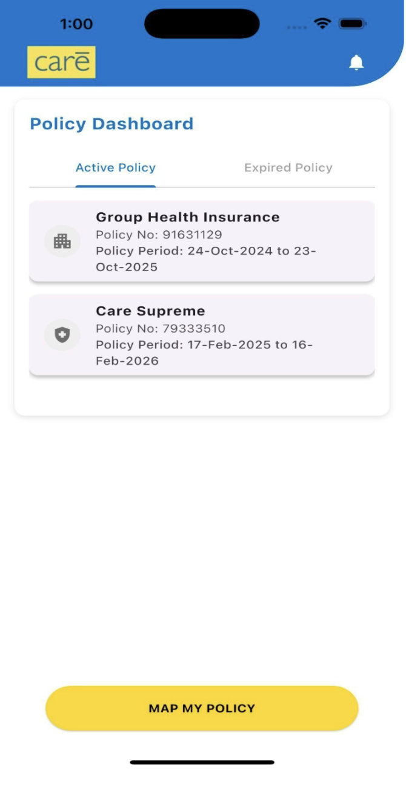
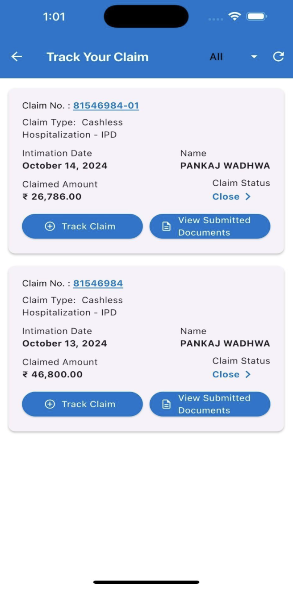
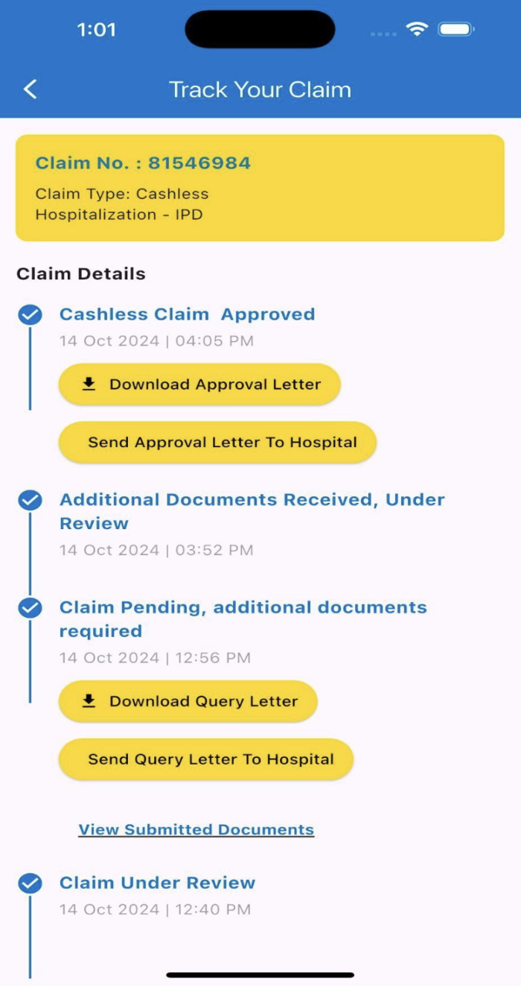
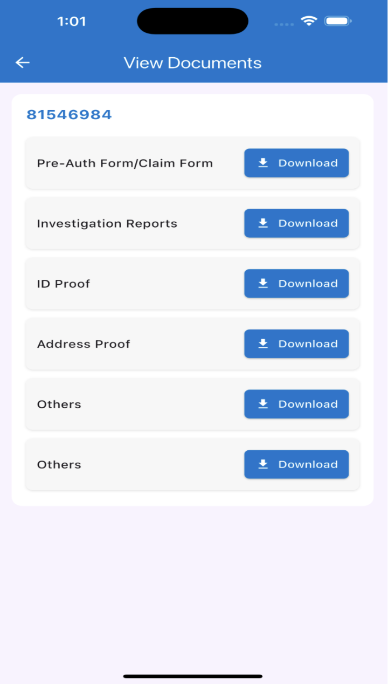

# Claim Status Tracker App

## Overview

Claim Status Tracker is a Flutter-based mobile application developed to help users monitor insurance claims and view real-time status updates through a structured and user-friendly interface.

## Problem Statement

Insurance customers often struggle to track the progress of their claims and understand the current status of their requests. The objective of this application was to provide a centralized platform for tracking claim updates and related information.

## Features

- Claim status tracking
- Timeline-based progress updates
- Structured claim listing
- User-friendly navigation
- Document viewing support

## Technologies Used

- Flutter
- Dart

## My Contribution

- Developed application screens and UI components
- Implemented user workflows for claim tracking
- Contributed to feature development and testing
- Improved usability through UI refinements

## Screenshots
## Screenshots

<h3>Login Screen</h3>

<h3>Policy Dashboard</h3>

<h3>Track Claim</h3>

<h3>Claim Timeline</h3>

<h3>Document Viewing</h3>

## Learning Outcomes

This project strengthened my skills in Flutter development, user workflow design, testing, and building applications for real-world business use cases.
